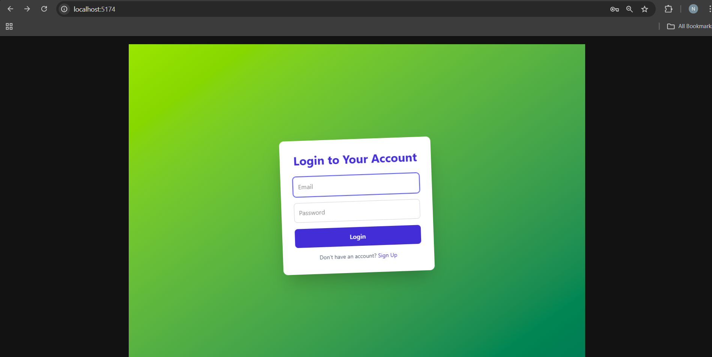
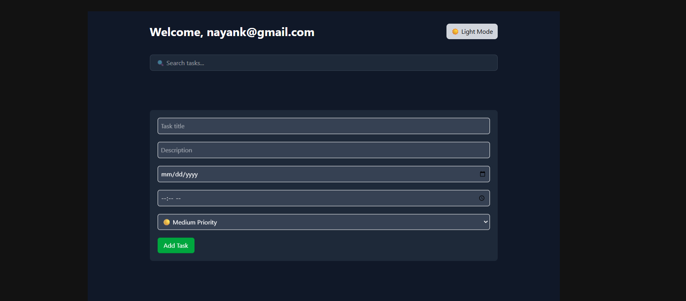
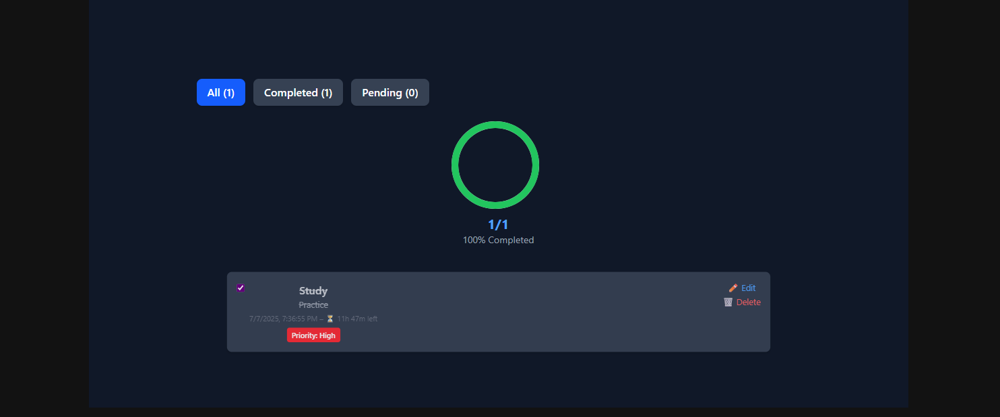
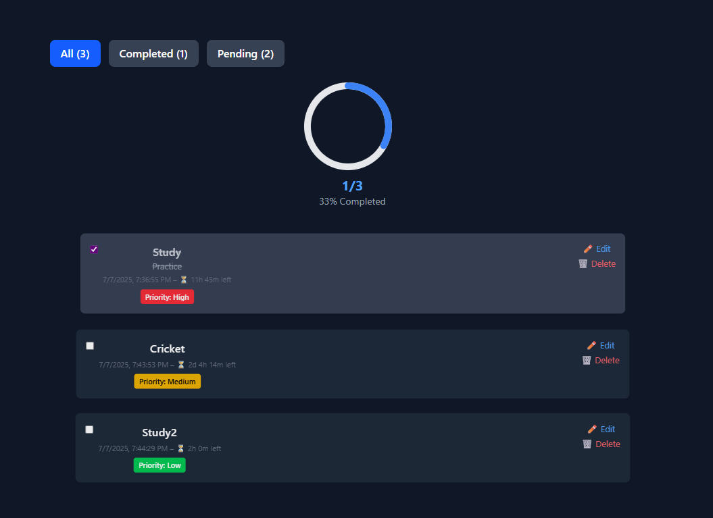
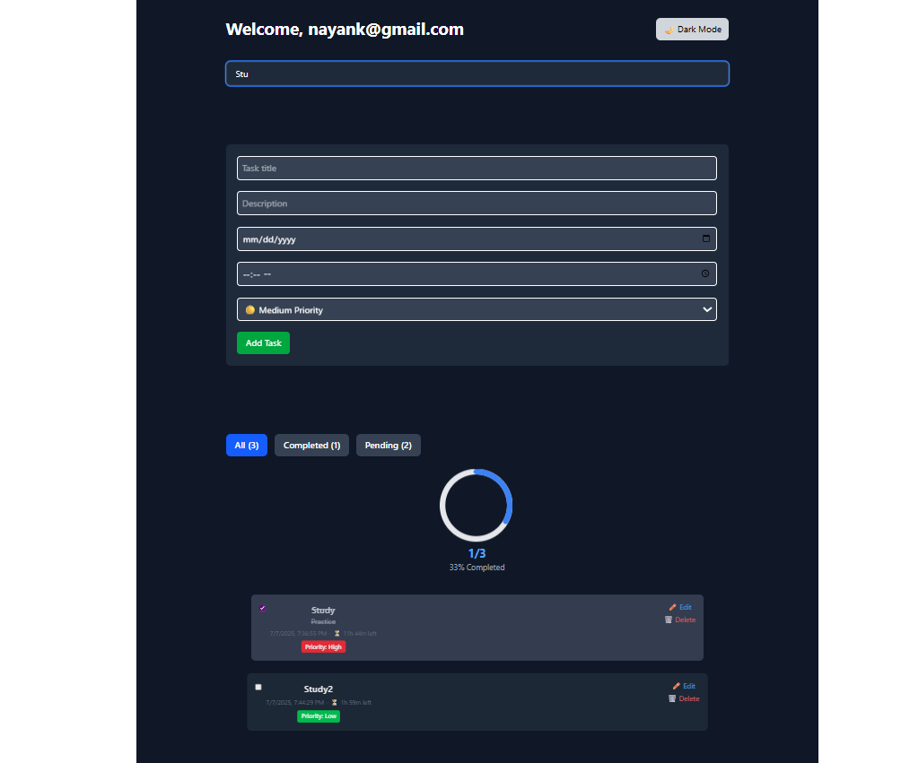

# Personal Task Tracker

A beautifully designed and feature-rich task management application built with **React.js**, **Tailwind CSS**, and **GSAP**. Keep your productivity high with animated progress tracking, smart filters, dark mode, and more!

---

## 📖 Description

**Personal Task Tracker** is a responsive and interactive web app that allows users to manage daily tasks efficiently. It supports task priorities, due dates (including time), search and filter functionality, and progress tracking inspired by LeetCode's progress wheel. It also includes animated UI transitions and a persistent dark mode toggle.

---

## 🚀 Features

- 📝 Create, edit, and delete tasks
- 📅 Set due dates and optional time
- 🔴 Task priority: High, Medium, Low
- ✅ Toggle task completion status
- 🔍 Search tasks by title
- 🎯 Filter by All, Completed, and Pending
- 🌙 Persistent dark mode with toggle
- ⚙️ Animated task form and item transitions using GSAP
- 📊 Interactive animated progress wheel (LeetCode-style)
- 🔒 Simple login/register with localStorage
- 🧠 Custom theme support with Tailwind CSS

---

## 🌐 Live Application
[🔗 Deployed on Vercel](https://brand-connect-five.vercel.app/) <!-- Replace with Vercel URL -->

---

## 📦 Tech Stack

| Frontend       | Backend         | Tools & DB         |
|----------------|------------------|--------------------|
| ReactJS        | Node.js (Express) | MongoDB (Mongoose) |
| TailwindCSS    | Axios             | Facebook Graph API |
| React Router   | JWT Auth          | Ngrok (for local testing) |

---

## 🛠️ Setup Instructions

### 1. Clone the repository
```bash
git clone https://github.com/yourusername/PersonalTaskTracker.git
cd frontend

# Setup the Frontend
cd client
npm install
npm run dev

## 📸 Screenshots

Below are a series of screenshots from the application:

### Sign Up Page


### Login Page


### Dashboard 









## ✅ What Sets This Apart

Clean, modular codebase with component-based structure.

Fully responsive design, optimized for practical customer support use.


## 🧑‍💻 Author
# Nayan Kathait

📧 nayankathait@gmail.com

----
